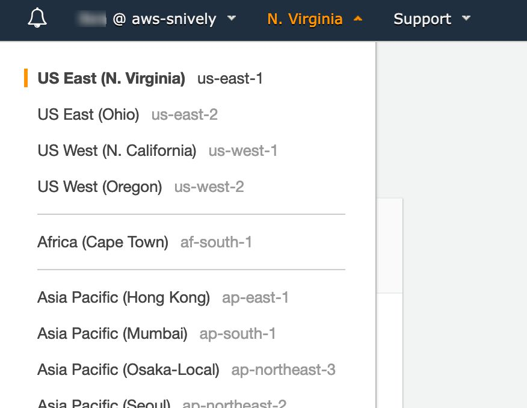

# Kendra Hands on Lab
Amazon Kendra is a highly accurate and easy to use enterprise search service that’s powered by machine learning. Kendra delivers powerful natural language search capabilities to your websites and applications so your end users can more easily find the information they need within the vast amount of content spread across your company.
Key Benefits of Kendra
Ask natural language questions, get immediate answers

Use natural language questions instead of just simple keywords to get the answers you’re looking for, whether that is a precise answer, an FAQ, or an entire document. Say goodbye to sifting through long lists of links and hoping one has the information you need.
Bring all of your data together in a few clicks

Get rid of information silos. Kendra lets you easily add content from file systems, SharePoint, intranet sites, file sharing services, and more, into a centralized location so you can quickly search all of your information to find the best answer.
Constantly improving search results

Your results get better over time search, because Kendra’s machine learning algorithms learn which results your users find most valuable. You also have the option to fine-tune results by manually adjusting the importance of certain data sources or document freshness.

## Introduction to the valuable

In this Hands on Lab, we'll step you through the steps to setup a new Index, ingest data using a connector, setting up an FAQ data source and performing some basic searches using the console.

We'll be using the well architected whitepapers and FAQ pages as an example to demonstrate the process and some of the results.

The AWS Well-Architected provides a consistent approach for customers and partners to evaluate architectures, and implement designs that can scale over time.

It will take approximately and hour to step through the lab.

## Setting up the Index

---

### Creating the Index

1. To create the index, first log into the AWS Administrative Console.  
https://signin.aws.amazon.com/console

2. Next, make sure you are in the Virginia Region:

3. Type Kendra into the Service Finder list and go into the Kendra Console

 This will launch you into the Kendra Administrative Console.  A direct link to this is also:
https://console.aws.amazon.com/kendra/home?region=us-east-1  

4. Select the <Create Index> button to create a new index 
 
This will step through creating the index.

5. Enter the following fields
  - Index Name: hands-on-tutorial
  - Description: < leave blank >
  - IAM Role: Create a new Role
  - Role Name: AmazonKendra-us-east-1-hands-on-tutorial

  Select the Next Button
  

6. Confirm the default "Developer edition" is selected and hit "Create"

---

## Leveraging a Kendra connector

 _Note: While often times it takes much less, the index creation may take up to 30 minutes, wait until the cluster goes from a "Creating" status to a "Active" status._

Use Kendra's connectors for popular sources like S3, SharePoint, Salesforce, Servicenow, RDS databases, One Drive and many more coming later this year. Using connectors is quick and easy, you just add data sources to your Kendra index and select the connector type. Connectors will maintain document access rights and can be scheduled to automatically sync your index with your data source, so you're always securely searching through the most up to date content. For other data source types, Kendra offers an API that allows you to build your own connector and upload documents from your ETL job or back-end application. Because each data source may contain different file types, Kendra supports unstructured and semi-structured data in HTML, MS Office Word and PowerPoint, PDF, and text formats.

Let's setup a connector to S3 now to ingest the Well Architected whitepapers.

1. If you aren't already in the Index details page, select the index name and launch into it's details. 

2. Select the Data sources option under Data Management 
 
You can see a list of various data connectors here.

3. Select the "Add connector" under Amazon S3.

4. Under the Data Source name, enter: "Well-architected-whitepapers" and select Next

5. In the Configure S3 connector section, enter:
  - Enter the data source location: _s3://serverless-analytics_
  - Select the IAM role you created earlier: _AmazonKendra-us-east-1-hands-on-tutorial_ **Expand "Additional Configuration - optional"**
  - Enter the "Include Patterns": _well-architected/documents/_
  - Select "Add"
  - Frequency: "Run on Demand"
  - Select "Next" 
  

6. Select "Next"

7. Select "Create"

8. After it's created, select the "Sync now" button 
   
  This will start the process of crawling and indexing the content the connector finds, as long as the IAM Role allows it to:
   
  This will run and index the whitepapers at that location: 
   

  ---

  ## Kendra FAQ Data sources

  Amazon Kendra can extract specific answers from unstructured data. No pre-training is required, you simply point Kendra at your content and Kendra will provide specific answers to natural language queries like "how do I configure my VPN?" where the answer is automatically extracted from the most relevant document. You can also upload a list of FAQs to Kendra to provide direct answers to common questions your end users are asking. Kendra will find the closest question to the search query and return the corresponding answer.

  We'll an FAQ data sources next.  

1. Under Data Management, select "FAQs" 
   
2. Select the "Add FAQ" Button 
   This will let you enter new FAQs in the index to compliment your other data sources.  We'll see how these results are returned shortly.
3. Enter the following Configuration
   - FAQ name: _well-architected-faqs_
   - S3: _s3://serverless-analytics/well-architected/faqs/wellarchtected_faq.csv_
   - Select the IAM role you created earlier: _AmazonKendra-us-east-1-hands-on-tutorial_
4. Select "Add", the page should look like this: 

---

## Querying the Index.

Next we'll show how you can use the text search console to query your index.  This is just one of many ways you can query your index.  

To see others, please look at the following links:
- Programmatic/API access:
https://docs.aws.amazon.com/kendra/latest/dg/searching-example.html
- Deploying Kendra to your website:
https://docs.aws.amazon.com/kendra/latest/dg/deploying.html

1. Select the "Search Console" option in the menu on the left: 
 
We can now search for various information from the well architected whitepaper and corresponding lens papers.
2. Let's start w/ the following query:
> What is the well architected framwork?

We can see a suggested answer on the top of the page 
 

We can also see a section returning from the FAQ data source below that. We'll look at these shortly.

Let's do another query though:

3. Let's query a bit more detail on well-architected.
> What are the well architected pillars?

We can see again the direct answer it pulled from the indexed whitepapers along w/ the answer from the FAQ data source: 
 

4. Let's now search a bit about IoT deployments:
>  How do I perform IoT deployments?

 
> How to deploy machine learning models to IoT?

 

---

## Closing thoughts

In this lab, we showed how you can quickly create a development or production search index, leverage multiple types of data connectors to bring in data that may be silo'ed into a searchable form, ingest FAQ pages, and test the index leveraging the built in search console.  

There are many other advanced features we haven't addressed in this lab, so please refer to the online documentation, technical training sessions, re:invent and summits and other resources to see how to build your next generation machine learning powered search solution.

---

## Cleaning your resources

To avoid any ongoing charges, please remember to clean out what you created.

1. Go into the Kendra console, select the index, and under Actions, select "Delete"

 
